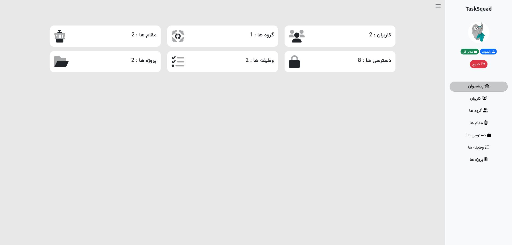
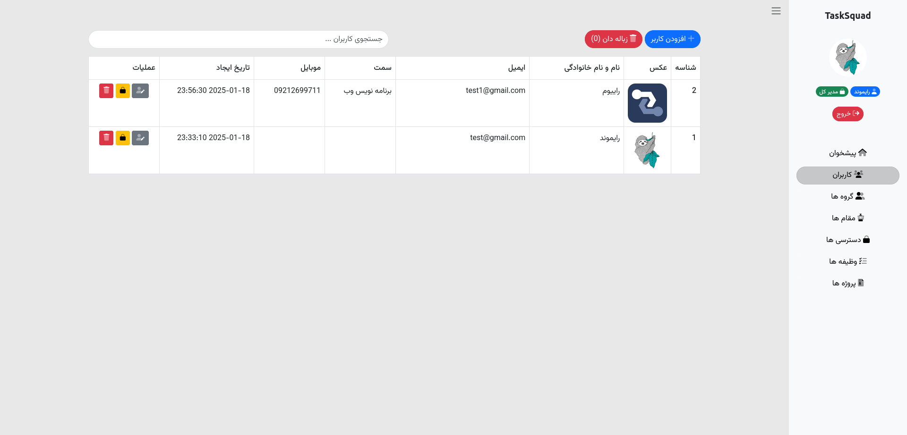
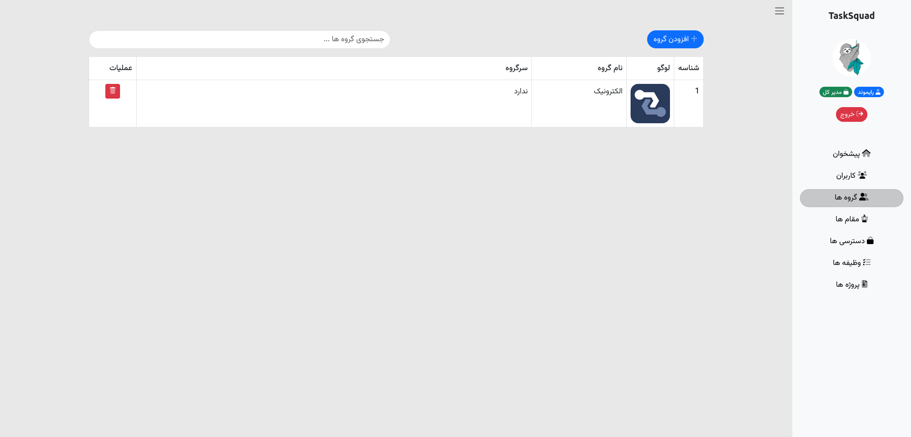
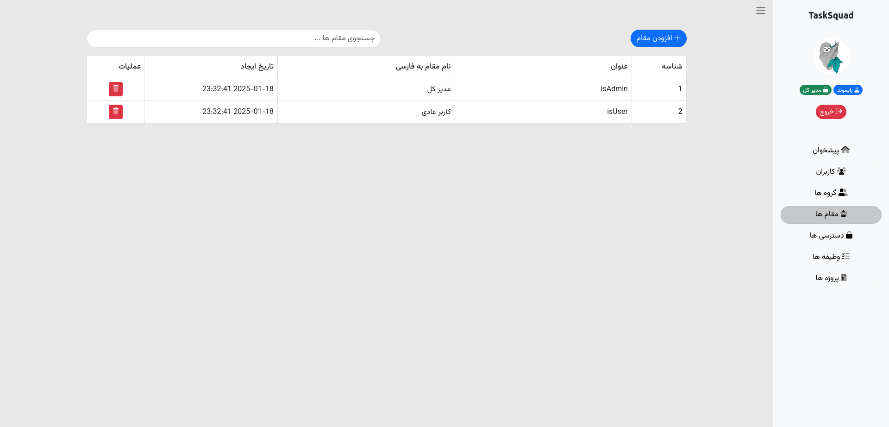
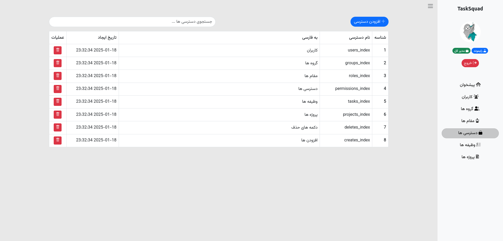
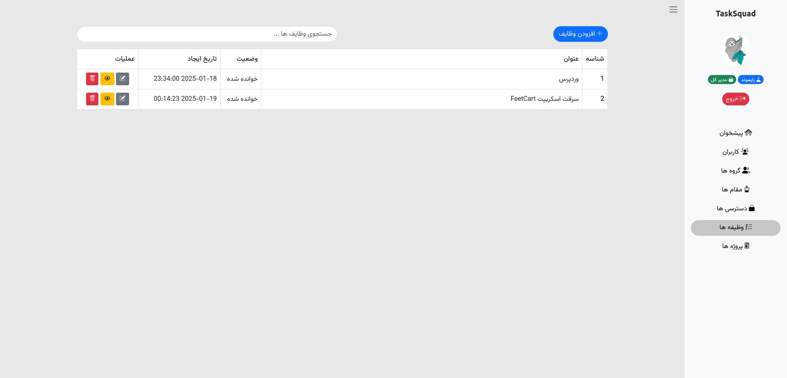
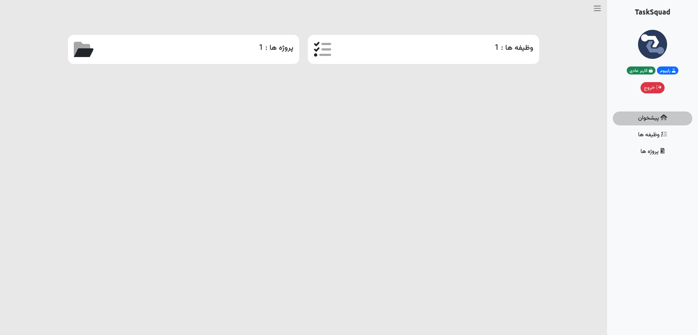
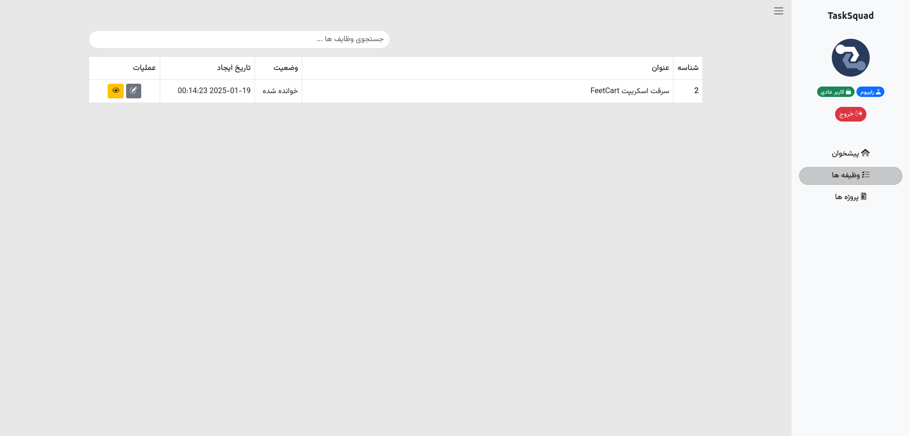
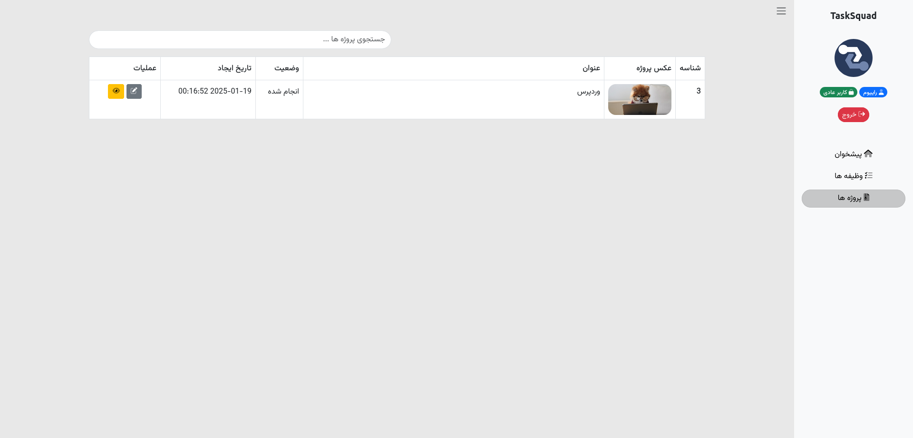

<p align="center">
    <picture>
        <source media="(prefers-color-scheme: dark)" srcset="./art/Dark_TaskSquad.png">
        <source media="(prefers-color-scheme: light)" srcset="./art/Light_TaskSquad.png">
        
    </picture>
</p>

## TaskSquad

A Tasks Management Project Based on Laravel and Livewire 

## How to use

```bash
git clone https://github.com/Rayiumir/TaskSquad.git
cd TaskSquad/
composer install
cp .env.example .env
php artisan migrate --seed
php artisan key:generate
php artisan serve
```

## ScreenShots

### Admin

<table class="table">
  <thead>
    <tr>
      <th scope="col" width="1000px">Admin Index</th>
      <th scope="col" width="1000px">Users</th>
      <th scope="col" width="1000px">Groups</th>
      <th scope="col" width="1000px">Roles</th>
    </tr>
  </thead>
  <tbody>
    <tr>
      <td>
        
      </td>
      <td>
        
      </td>
      <td>
        
      </td>
      <td>
        
      </td>
    </tr>
  </tbody>
</table>
<table class="table">
  <thead>
    <tr>
      <th scope="col" width="1000px">Permissions</th>
      <th scope="col" width="1000px">Tasks</th>
      <th scope="col" width="1000px">Projects</th>
    </tr>
  </thead>
  <tbody>
    <tr>
      <td>
        
      </td>
      <td>
        
      </td>
      <td>
        
      </td>
    </tr>
  </tbody>
</table>

### User

<table class="table">
  <thead>
    <tr>
      <th scope="col" width="1000px">User Index</th>
      <th scope="col" width="1000px">Tasks</th>
      <th scope="col" width="1000px">Projects</th>
    </tr>
  </thead>
  <tbody>
    <tr>
      <td>
        
      </td>
      </td>
      <td>
        
      </td>
      <td>
        
      </td>
    </tr>
  </tbody>
</table>

# Directory Structure

```bash
Directory structure:
└── rayiumir-tasksquad/
    ├── README.md
    ├── LICENSE
    ├── artisan
    ├── composer.json
    ├── composer.lock
    ├── package.json
    ├── phpunit.xml
    ├── postcss.config.js
    ├── tailwind.config.js
    ├── vite.config.js
    ├── .editorconfig
    ├── .env.example
    ├── app/
    │   ├── Http/
    │   │   └── Controllers/
    │   │       ├── AdminController.php
    │   │       ├── Controller.php
    │   │       ├── HomeController.php
    │   │       └── Auth/
    │   │           ├── ConfirmPasswordController.php
    │   │           ├── ForgotPasswordController.php
    │   │           ├── LoginController.php
    │   │           ├── RegisterController.php
    │   │           ├── ResetPasswordController.php
    │   │           └── VerificationController.php
    │   ├── Livewire/
    │   │   └── Support/
    │   │       ├── Admin/
    │   │       │   └── Index.php
    │   │       ├── Groups/
    │   │       │   ├── Create.php
    │   │       │   └── Index.php
    │   │       ├── Permissions/
    │   │       │   ├── Create.php
    │   │       │   └── Index.php
    │   │       ├── Projects/
    │   │       │   ├── Create.php
    │   │       │   ├── Index.php
    │   │       │   ├── Show.php
    │   │       │   └── Status.php
    │   │       ├── Roles/
    │   │       │   ├── Create.php
    │   │       │   └── Index.php
    │   │       ├── Tasks/
    │   │       │   ├── Create.php
    │   │       │   ├── Index.php
    │   │       │   ├── Show.php
    │   │       │   └── Status.php
    │   │       └── Users/
    │   │           ├── Create.php
    │   │           ├── Edit.php
    │   │           ├── Index.php
    │   │           ├── PermissionUser.php
    │   │           └── Trash.php
    │   ├── Models/
    │   │   ├── Groups.php
    │   │   ├── Permissions.php
    │   │   ├── Project.php
    │   │   ├── ProjectStatus.php
    │   │   ├── Roles.php
    │   │   ├── Task.php
    │   │   ├── TaskStatus.php
    │   │   └── User.php
    │   └── Providers/
    │       ├── AppServiceProvider.php
    │       └── AuthServiceProvider.php
    ├── art/
    ├── bootstrap/
    │   ├── app.php
    │   ├── providers.php
    │   └── cache/
    │       └── .gitignore
    ├── config/
    │   ├── app.php
    │   ├── auth.php
    │   ├── cache.php
    │   ├── database.php
    │   ├── filesystems.php
    │   ├── livewire.php
    │   ├── logging.php
    │   ├── mail.php
    │   ├── queue.php
    │   ├── services.php
    │   └── session.php
    ├── database/
    │   ├── .gitignore
    │   ├── factories/
    │   │   └── UserFactory.php
    │   ├── migrations/
    │   │   ├── 0001_01_01_000000_create_users_table.php
    │   │   ├── 0001_01_01_000001_create_cache_table.php
    │   │   ├── 0001_01_01_000002_create_jobs_table.php
    │   │   ├── 2024_12_09_122852_create_groups_table.php
    │   │   ├── 2024_12_09_232620_create_roles_table.php
    │   │   ├── 2024_12_11_153016_create_permissions_table.php
    │   │   ├── 2024_12_11_153245_create_permissions_user_table.php
    │   │   ├── 2024_12_11_153345_create_role_user_table.php
    │   │   ├── 2024_12_11_211513_create_tasks_table.php
    │   │   ├── 2024_12_11_211626_create_task_statuses_table.php
    │   │   ├── 2024_12_20_232832_create_projects_table.php
    │   │   └── 2025_01_05_231057_create_project_statuses_table.php
    │   └── seeders/
    │       ├── DatabaseSeeder.php
    │       ├── PermissionsSeeder.php
    │       ├── RolesSeeder.php
    │       └── StatusSeeder.php
    ├── public/
    │   ├── index.php
    │   ├── robots.txt
    │   ├── .htaccess
    │   ├── css/
    │   │   ├── all.css
    │   │   └── admin/
    │   │       └── style.css
    │   ├── img/
    │   ├── js/
    │   │   ├── main.js
    │   │   └── sweetalert2.js
    │   ├── vendor/
    │   │   └── livewire-alert/
    │   │       └── livewire-alert.js
    │   └── webfonts/
    │       ├── fa-brands-400.ttf
    │       ├── fa-brands-400.woff2
    │       ├── fa-duotone-900.ttf
    │       ├── fa-duotone-900.woff2
    │       ├── fa-solid-900.ttf
    │       └── fa-solid-900.woff2
    ├── resources/
    │   ├── css/
    │   │   └── app.css
    │   ├── js/
    │   │   ├── app.js
    │   │   └── bootstrap.js
    │   ├── sass/
    │   │   ├── _variables.scss
    │   │   └── app.scss
    │   └── views/
    │       ├── welcome.blade.php
    │       ├── auth/
    │       │   ├── login.blade.php
    │       │   ├── register.blade.php
    │       │   ├── verify.blade.php
    │       │   └── passwords/
    │       │       ├── confirm.blade.php
    │       │       ├── email.blade.php
    │       │       └── reset.blade.php
    │       ├── layouts/
    │       │   ├── admin.blade.php
    │       │   └── app.blade.php
    │       └── livewire/
    │           └── support/
    │               ├── admin/
    │               │   ├── index.blade.php
    │               │   └── inc/
    │               │       ├── navbar.blade.php
    │               │       └── sidebar.blade.php
    │               ├── groups/
    │               │   ├── create.blade.php
    │               │   └── index.blade.php
    │               ├── permissions/
    │               │   ├── create.blade.php
    │               │   └── index.blade.php
    │               ├── projects/
    │               │   ├── create.blade.php
    │               │   ├── index.blade.php
    │               │   ├── show.blade.php
    │               │   └── status.blade.php
    │               ├── roles/
    │               │   ├── create.blade.php
    │               │   └── index.blade.php
    │               ├── tasks/
    │               │   ├── create.blade.php
    │               │   ├── index.blade.php
    │               │   ├── show.blade.php
    │               │   └── status.blade.php
    │               └── users/
    │                   ├── create.blade.php
    │                   ├── edit.blade.php
    │                   ├── index.blade.php
    │                   ├── permissionUser.blade.php
    │                   └── trash.blade.php
    ├── routes/
    │   ├── console.php
    │   └── web.php
    ├── screenshots/
    │   ├── admin/
    │   └── user/
    ├── storage/
    │   ├── app/
    │   │   ├── .gitignore
    │   │   ├── private/
    │   │   │   └── .gitignore
    │   │   └── public/
    │   │       └── .gitignore
    │   ├── framework/
    │   │   ├── .gitignore
    │   │   ├── cache/
    │   │   │   ├── .gitignore
    │   │   │   └── data/
    │   │   │       └── .gitignore
    │   │   ├── sessions/
    │   │   │   └── .gitignore
    │   │   ├── testing/
    │   │   │   └── .gitignore
    │   │   └── views/
    │   │       └── .gitignore
    │   └── logs/
    │       └── .gitignore
    └── tests/
        ├── TestCase.php
        ├── Feature/
        │   └── ExampleTest.php
        └── Unit/
            └── ExampleTest.php
```
